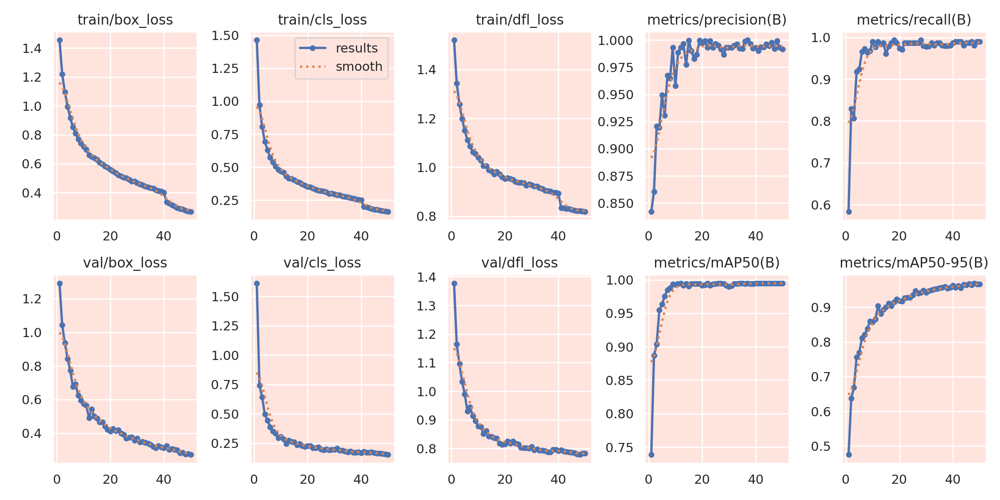
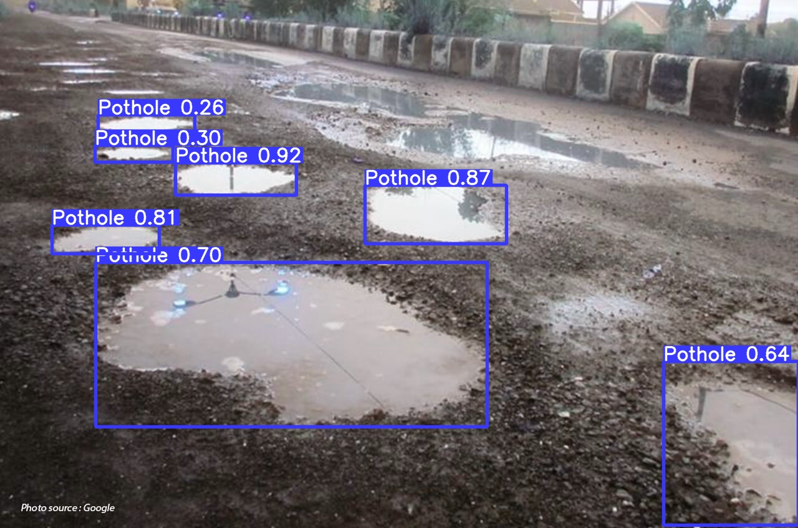

<h1 align="center"> Pothole Detection Project </h1>
<p align="center"> Deep Learning Model based on YOLOV8 by Ultralytics</p>

<div align="center">

  <a href="https://www.python.org/">
    
  </a>
  <a href="https://jupyter.org/">
    
  </a>
  <a href="https://pytorch.org/">
    
  </a>
  <a href="https://flask.palletsprojects.com/">
    
  </a>
  <a href="https://github.com/ultralytics/ultralytics">
    
  </a>

</div>
<h1 align="center"></h1>

# A. Resources
- ### [Anotated Dataset](https://universe.roboflow.com/school-kwzhr/pothole-fko0z)
- ### [Base Model yolov8l by Ultralytics](https://github.com/ultralytics/assets/releases/download/v0.0.0/yolov8l.pt)
- ### [Pothole Detection Model](https://drive.google.com/drive/folders/1_RbQK4XePotMLD8VEliewattmBs7GSvp?usp=sharing) 

# B. Model Performance Metrics

### Summary model performance
    

### Training Metrics
| Metric         | Value    |
|----------------|----------|
| Box Loss       | 0.26979  |
| Class Loss     | 0.16355  |
| DFL Loss       | 0.8193   |

### Validation Metrics
| Metric         | Value    |
|----------------|----------|
| Box Loss       | 0.27256  |
| Class Loss     | 0.15397  |
| DFL Loss       | 0.78293  |

### Performance Metrics
| Metric             | Value    |
|--------------------|----------|
| mAP50(B)           | 0.9949   |
| mAP50-95(B)        | 0.97009  |
| Precision(B)       | 0.99919  |
| Recall(B)          | 0.98033  |


# C. Inference Model with Flask
- ### Don't forget to download the [Pothole Detection Model](https://drive.google.com/drive/folders/1_RbQK4XePotMLD8VEliewattmBs7GSvp?usp=sharing)
- ### Python 3.10.14 I use this version when inference the model
- ### Install requirements.txt 
    ```javascripts
    pip install -r requirements.txt
    ```
- ### Run the flask application
    ```javascripts
    python app.py
    ```
  ### Disclaimer
  > This Flask application receives a hex representation of an image as input. The code converts the input hex data into an image. The image is then processed by the model to perform the detection task. After detection, the annotated image is converted back into hex format and sent to the Frontend Team as a JSON.

- ### Example usage using Postman
  

- ### Example result
    
